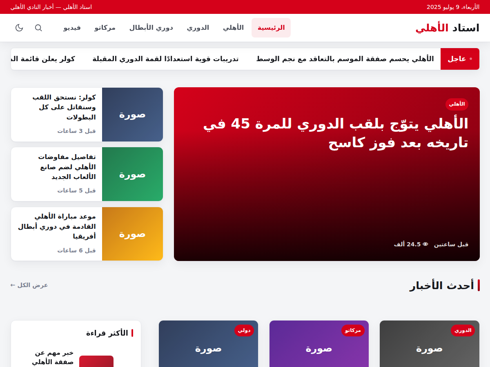

# Manchit — قالب أخبار ووردبريس فائق السرعة ومُحسّن لجوجل نيوز

**Manchit (مانشيت)** قالب أخبار عربي (RTL) بُني من الصفر ليتفوّق على قوالب الأخبار التجارية في **السرعة، والسيو (خاصة Google News و Google Discover واقتراحات جوجل)، ونظام الإعلانات، ونظام الخطوط، وتجربة القراءة البصرية**.

> القالب مخصّص لمواقع الأخبار على ووردبريس (مثال الاستخدام: موقع رياضي عربي).



## لماذا Manchit أفضل؟

| المحور | Manchit |
|--------|---------|
| **السرعة** | بدون jQuery في الواجهة · Critical CSS مضمّن · خطوط بـ `display:swap`+`preload` · `fetchpriority` على صورة LCP · lazy-load للصور و iframes · إزالة أكواد ووردبريس الزائدة |
| **السيو** | JSON-LD كامل: `NewsArticle` + `NewsMediaOrganization` + `WebSite`(SearchAction) + `BreadcrumbList` + `Speakable` |
| **Google Discover** | توجيه `max-image-preview:large` + صور 1200×630 + Open Graph & Twitter Cards |
| **اقتراحات جوجل** | Sitelinks Search Box schema |
| **الإعلانات** | مواضع متعددة + حقن داخل المقال + استهداف أجهزة — **١٠٠٪ من الأرباح لك** (لا حقن لإعلانات المطوّر ولا نسبة أرباح) |
| **الخطوط** | Cairo · Tajawal · Noto Kufi Arabic · IBM Plex Sans Arabic · Readex Pro · أو خط النظام |
| **تجربة القراءة** | وضع ليلي/نهاري · شريط تقدم القراءة · جدول محتويات تلقائي · أزرار مشاركة · شريط أخبار عاجلة |
| **التوافق** | RTL أولاً · محرر الكتل (theme.json) · Customizer · لوحة تحكم كاملة · جاهز للترجمة |

## التثبيت

1. حمّل مجلد `manchit/` كملف ZIP، أو انسخه إلى `wp-content/themes/`.
2. فعّله من **المظهر ← القوالب**.
3. اضبط الإعدادات من **المظهر ← إعدادات Manchit** (عام · خطوط · تخطيط · مقالات · السيو وجوجل نيوز · إدارة الإعلانات · التواصل).

### إنشاء ملف ZIP للرفع
```bash
cd manchit && zip -r ../manchit.zip . -x '.*'
```

## بنية القالب

```
manchit/
├── style.css              # نظام التصميم الكامل (RTL/LTR بخصائص منطقية)
├── theme.json             # إعدادات محرر الكتل
├── functions.php          # الإقلاع
├── header.php · footer.php · index.php · home.php · single.php
├── archive.php · search.php · page.php · 404.php · comments.php
├── sidebar.php · searchform.php
├── inc/                   # الوحدات
│   ├── options.php        # مخزن الخيارات + مساعدات
│   ├── setup.php          # دعم القالب، القوائم، أحجام الصور
│   ├── performance.php    # السرعة و Core Web Vitals
│   ├── enqueue.php · fonts.php
│   ├── seo.php            # Schema · OG · Google News/Discover
│   ├── breadcrumbs.php · toc.php · post-views.php
│   ├── ads.php            # محرك الإعلانات
│   ├── customizer.php · admin-panel.php · widgets.php · nav-walker.php
│   ├── template-tags.php · template-functions.php
├── template-parts/        # أجزاء القوالب
└── assets/                # css · js · fonts · img
```

## المتطلبات
- WordPress 6.0+
- PHP 7.4+

## الترخيص
GPLv2 أو أحدث.
